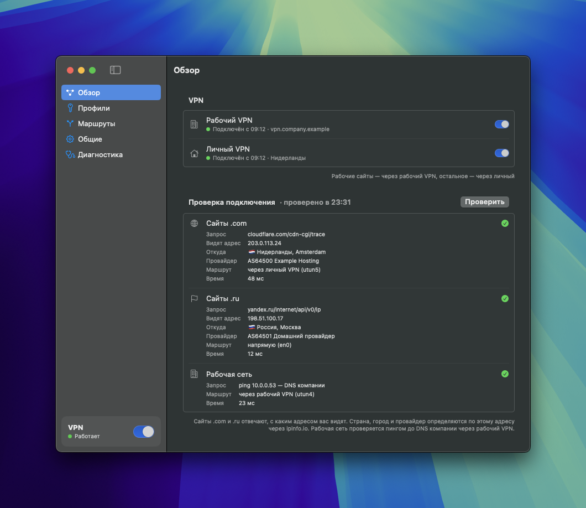
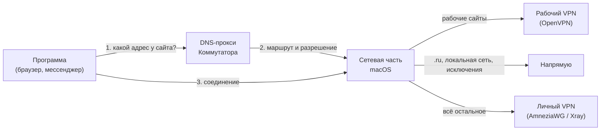

# Коммутатор

Приложение для macOS: окно с настройками и значок в строке меню. Держит сразу два VPN, рабочий и личный, и само решает, куда отправить каждое соединение:

1. рабочие сайты и адреса (корпоративные домены, IP и маршруты, которые присылает сервер) идут через **рабочий VPN** (OpenVPN);
2. `.ru`, `.su`, `.рф`, локальная сеть и ваши исключения идут **напрямую**;
3. всё остальное идёт через **личный VPN**: AmneziaWG (или обычный WireGuard) либо Xray (VLESS, Hysteria2, Trojan, Shadowsocks, VMess);
4. если нужный туннель упал, трафик блокируется, а не утекает другим путём. Для личного VPN эту защиту (kill switch) можно выключить.

**[⬇ Скачать Commutator.pkg](https://github.com/and-sheera/commutator/releases/latest/download/Commutator.pkg)** · [все версии](https://github.com/and-sheera/commutator/releases)

## Требования

- Mac на Apple Silicon (M1 и новее). На Mac с Intel не запустится.
- macOS 14 Sonoma или новее.

## Установка

1. Скачайте **Commutator.pkg** по ссылке выше.
2. Откройте его двойным кликом. Пакет не подписан у Apple, поэтому macOS скажет, что не может проверить разработчика. Нажмите **«Готово»** (не «Переместить в Корзину»).
3. Откройте **Системные настройки → Конфиденциальность и безопасность**, пролистайте вниз до сообщения про «Commutator.pkg» и нажмите **«Всё равно открыть»**. macOS может спросить пароль или Touch ID.
4. В установщике нажмите **«Продолжить» → «Установить»** и введите пароль администратора.
5. Коммутатор откроется сам. Дальше — [первая настройка](#первая-настройка).

### Какие запросы вы увидите

| Когда | Что | Зачем |
|---|---|---|
| Открытие pkg | Предупреждение и «Всё равно открыть» | Нет платной подписи Apple, см. выше |
| Установка | Пароль администратора, один раз | Служба, которая меняет маршруты, файрвол и DNS, работает с правами root |
| Сразу после установки | Уведомление «Добавлены фоновые объекты» | macOS сообщает о новой фоновой службе. Нажимать ничего не нужно |
| Первое включение или падение VPN | «Разрешить уведомления?» | Чтобы сообщать, что VPN включился или упал. Можно отказать |
| Импорт OpenVPN-профиля со `script` или `plugin` | Пароль администратора | Такой профиль запускает сторонние программы с правами root, поэтому нужно ваше подтверждение |

Больше Коммутатор ничего не просит: ни связки ключей, ни полного доступа к диску, ни VPN-конфигураций в системных настройках.

## Первая настройка

1. **Профили.** На странице «Профили» у рабочего VPN нажмите «Добавить .ovpn…» (профиль самодостаточный, режим TUN). У личного VPN нажмите «Добавить…» и перетащите файл AmneziaWG или WireGuard `.conf` либо вставьте ссылку. Файлы `.ovpn` и `.conf` можно просто перетащить в окно. Профиль нужен только для того VPN, которым пользуетесь.
2. **Какие ссылки подходят.** Тип Коммутатор определяет сам:
   - `vpn://…` из Amnezia («Поделиться VPN» → «Соединение») — это AmneziaWG;
   - `vless://`, `hysteria2://`, `trojan://`, `ss://`, `vmess://` или адрес подписки `https://…`, как в Happ, — это Xray.

   Подписка может быть списком ссылок, base64 или JSON-массивом конфигов Xray. Коммутатор обновляет её сам: как задаёт `profile-update-interval`, по умолчанию раз в 12 часов. Остаток трафика и срок действия он берёт из `subscription-userinfo`. Зашифрованные подписки `happ://crypt…` не поддерживаются.

   Профилей личного VPN можно сохранить сколько угодно: файлов, ссылок и подписок. Работает тот, что добавили последним. Переключиться можно в списке «Профиль» у личного VPN, удалить ненужный — в меню «Удалить» под ним. Подписка, которая сейчас не используется, обновится, когда её снова выберут.
3. **Логин и пароль OpenVPN.** Поле «Пароль» отвечает на любой запрос пароля OpenVPN: и на пароль учётной записи (`auth-user-pass`), и на пароль зашифрованного ключа (`BEGIN ENCRYPTED PRIVATE KEY`). Это тот же пароль, что спрашивает официальный клиент. Поле «Логин» появляется, только если в профиле есть `auth-user-pass`.
4. **Правила.** На странице «Маршруты» перечислите рабочие сайты и исключения «напрямую». Чтобы перенести правила на другой Mac, используйте «Экспорт» и «Импорт» через буфер обмена.
5. **Включение.** Переключатель внизу боковой панели окна или в меню строки меню. Иконку в строке меню можно скрыть в «Общих».

Любой из двух VPN можно выключить переключателем «Использовать» в «Профилях» или в его строке на «Обзоре» и в меню. Без рабочего VPN рабочие правила не действуют, и такие адреса идут как обычный трафик. Без личного VPN всё, что не попало в правила, идёт напрямую, а рабочий трафик по-прежнему заблокирован, пока рабочий VPN не подключён.

Загруженный профиль можно поправить прямо в приложении: «Изменить…» в «Профилях». Исходный файл при этом не меняется.

## Как это работает и чем отличается от обычного VPN-клиента

**Обычный VPN-клиент** поднимает один туннель. Весь трафик идёт либо в него, либо мимо. Некоторые клиенты умеют split tunneling, но исключения в нём задаются списком IP-адресов или программ. Два таких клиента одновременно не уживаются: каждый хочет стать маршрутом по умолчанию (тем, куда уходит всё, для чего нет отдельного правила) и подменить DNS (службу, которая превращает имя сайта в адрес).

**Коммутатор держит три пути одновременно:** рабочий VPN, личный VPN и прямой выход в интернет. Путь выбирается по **имени сайта**, а не только по адресу.

1. Программа спрашивает адрес сайта. Этот вопрос попадает к локальному DNS-прокси Коммутатора.
2. Прокси смотрит на имя и спрашивает адрес у DNS того пути, которому сайт принадлежит: рабочий DNS, DNS текущей сети или DNS личного VPN. Для сайта из правил он **сначала** прокладывает маршрут к полученному адресу в нужный туннель и разрешает этот адрес в файрволе, и **только потом** отдаёт адрес программе. Поэтому уже первое соединение идёт правильным путём.
3. Всё, чего нет в правилах, уходит маршрутом по умолчанию через личный VPN.

**Защита от утечек.** В macOS встроен файрвол PF. Коммутатор пишет в него правила: трафик каждого класса может выйти только через свой интерфейс. Если туннель упал, соединения блокируются, а не уходят в обычный интернет. Для личного VPN это можно выключить в «Общих», тогда на время обрыва трафик пойдёт напрямую.

**Без Network Extension.** VPN-клиенты из App Store работают через Network Extension, а для этого нужна подпись Apple. Коммутатор устроен иначе: небольшая системная служба с правами root управляет штатными механизмами macOS (таблицей маршрутов, PF, настройками DNS). Поэтому приложение можно раздавать бесплатно, но при установке нужен пароль администратора.

**Движки те же, что у официальных клиентов:** `openvpn`, `amneziawg-go` и `xray`. Они собраны из исходников и лежат внутри приложения, отдельно ничего ставить не нужно.

**Где хранятся секреты.** Профили и пароль хранит системная служба в `/var/db/com.vpnrouter` (доступ только у root). Обратно в приложение пароль не передаётся, связка ключей не используется.

## Обновление

Коммутатор сам проверяет обновления: при запуске и раз в 6 часов. Когда выходит новая версия, приходит уведомление, а в меню и в окне появляется плашка «Доступна версия…».

1. Нажмите «Скачать». Пока идёт скачивание, VPN работает как обычно.
2. Когда появится «Обновление скачано», нажмите «Обновить и перезапустить…», когда вам удобно. VPN выключится примерно на минуту, Коммутатор перезапустится новой версией и включит VPN снова.

Профили, правила и настройки сохранятся. Текущая версия и кнопка «Проверить сейчас» — в «Общих» → «Обновления».

Если кнопка не сработала, скачайте новый Commutator.pkg [по той же ссылке](https://github.com/and-sheera/commutator/releases/latest/download/Commutator.pkg) и установите поверх, как в первый раз. Так же обновляются версии до 1.0.7, в которых кнопки ещё нет.

## Удаление

**«Удалить Коммутатор…»** внизу раздела «Общие». Если Коммутатор установлен из pkg в «Программы», пароль не нужен, иначе macOS спросит пароль администратора. Приложение выключит VPN, вернёт сеть в состояние до установки и удалит себя, системную службу, профили и настройки.

Если приложение уже удалили перетаскиванием в Корзину, системная служба осталась. Установите Commutator.pkg снова и нажмите ту же кнопку.

## Ограничения

- Нужны TUN OpenVPN без MFA/OTP и AWG с одним peer, содержащим `0.0.0.0/0`. Поддерживаются профили AmneziaWG 2.0 и 3.x, включая параметры 3.1 (`HeaderProtectionKey`, `ContentPaddingAddition`, `RandomTrailers` и другие).
- Xray на macOS поднимает туннель только по IPv4: пока выбран Xray, IPv6 блокируется. DNS остального трафика при Xray идёт на 1.1.1.1 и 8.8.8.8 через туннель, поэтому сервер должен пропускать UDP.
- Xray v26 не отключает проверку сертификата: ссылка с `insecure=1` без `pinSHA256` отклоняется.
- Hysteria2 в Xray появился недавно; с обфускацией salamander возможны сбои — проверьте на своём сервере.
- Скрипты и plugins OpenVPN допускаются только после подтверждения администратора и считаются полностью доверенными. Линуксовые DNS-скрипты вроде `up /etc/openvpn/update-resolv-conf` Коммутатор просто пропускает: на macOS их нет, DNS он настраивает сам.
- Правила для сайтов обходят DoH в браузере, Private Relay, собственные DNS-кэши программ и общие адреса CDN. Подробности и как это выключить — в «Общих» приложения.
- Если сервер рабочего VPN не прислал свой DNS, рабочие имена видит DNS текущей сети. Это можно запретить в «Общих», тогда такие запросы блокируются.
- Без `DNS =` в AWG-профиле системный DNS не трогается, и имена всего трафика вне правил по-прежнему видит DNS текущей сети.
- С `DNS =` в AWG-профиле имена трафика вне правил не разрешаются, пока туннель AmneziaWG не поднялся.
- С `DNS =` падение системной службы на несколько секунд оставляет Mac без DNS: launchd поднимает её заново, и она восстанавливает настройки.
- Порт `127.0.0.1:53` должен быть свободен (его может занимать dnsmasq, dnscrypt или Docker). Занятый порт даёт понятную ошибку при включении.
- Одновременная работа с другим VPN не поддерживается.
- Включённая маршрутизация переживает падение и обновление службы. После перезагрузки Mac она поднимается сама, только если включено «Открывать при входе в macOS», иначе ждёт переключателя в приложении. Выход из приложения выключает VPN (после подтверждения), а без «Открывать при входе» его выключает и выход из учётной записи.
- Без IPv4-шлюза по умолчанию (например, на некоторых point-to-point линках) прямой трафик блокируется, в «Диагностике» появляется запись об этом.

## Для разработчиков

Сборка, выпуск релиза и устройство изнутри описаны в [DEVELOP.md](DEVELOP.md).

## Лицензия

[MIT](LICENSE). Встроенные движки распространяются под своими лицензиями, см. [THIRD_PARTY_NOTICES.md](THIRD_PARTY_NOTICES.md).
